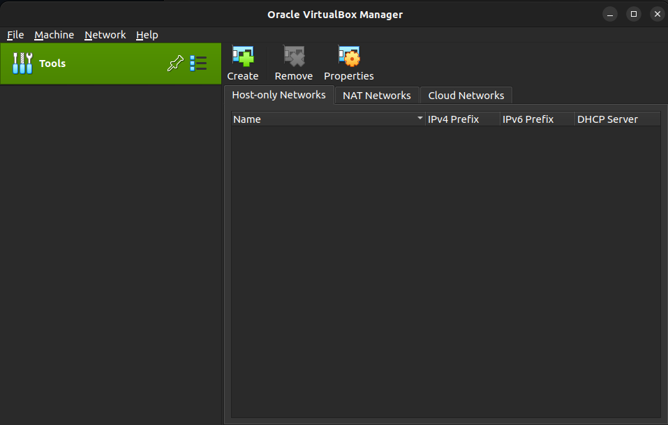
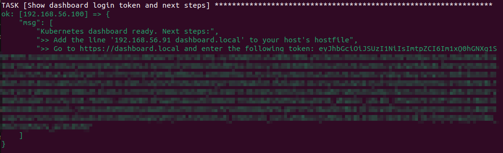
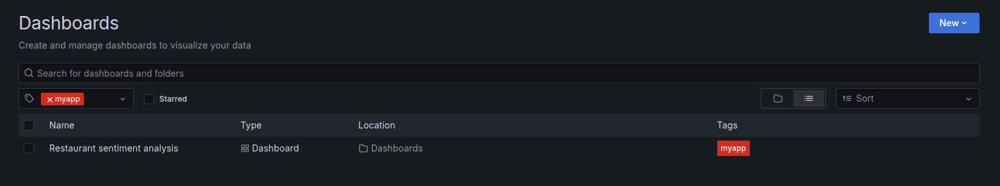
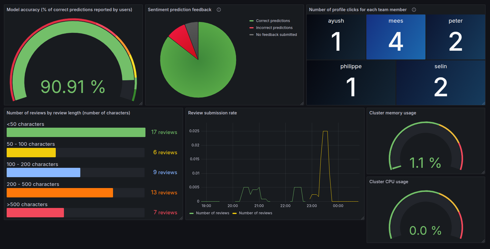

# Operation

REMLA Group 12

<!-- TABLE OF CONTENTS -->
<details>
  <summary><b>Table of Contents</b></summary>
  <ol>
    <li>
      <a href="#about-the-project">About the Project</a>
      <ul>
        <li>
          <a href="#relevant-repositories">Relevant Repositories</a>
        </li>
      </ul>
    </li>
    <li>
      <a href="#getting-started">Getting Started</a>
      <ul>
        <li><a href="#deployment-with-docker">Deployment with Docker</a></li>
        <!-- <ul>
          <li><a href="#prerequisites-for-docker">Prerequisites</a></li>
          <li><a href="#install-and-run-with-docker">Install and run</a></li>
        </ul> -->
        <li><a href="#kubernetes-cluster-setup">Kubernetes Cluster setup</a></li>
        <li><a href="#deployment-on-kubernetes-cluster-helm">Deployment on Kubernetes Cluster (Helm)</a></li>
      </ul>
    </li>
    <li><a href="#app-usage-minikube">App Usage (Minikube)</a></li>
    <li><a href="#continuous-progress-log">Continuous Progress Log</a></li>
      <ul>
        <li><a href="#assignment-1">Assignment 1</a></li>
        <li><a href="#assignment-2">Assignment 2</a></li>
        <li><a href="#assignment-3">Assignment 3</a></li>
      </ul>
  </ol>
</details>

# About the Project

This is an adaptation and application of the [Restaurant Sentiment Analysis](https://github.com/proksch/restaurant-sentiment) project.
This repository serves as the central point of the project, containing the Docker and Kubernetes deployment configurations, installation instructions, and links to other relevant components and repositories.

## Relevant Repositories

| Repository                                                         | Purpose                                                                                   |
| ------------------------------------------------------------------ | ----------------------------------------------------------------------------------------- |
| [model-training](https://github.com/remla25-team12/model-training) | Training pipeline for the restaurant sentiment analysis model.                            |
| [model-service](https://github.com/remla25-team12/model-service)   | Model wrapper for communication with other components of the project, e.g. for inference. |
| [lib-ml](https://github.com/remla25-team12/lib-ml)                 | Preprocessing logic for input data, used during model training and inference.             |
| [lib-version](https://github.com/remla25-team12/lib-version)       | A simple version-aware libary that reports its own version.                               |
| [app](https://github.com/remla25-team12/app)                       | Webapp (frontend + service) to interface with the model.                                  |

---

# Getting Started

## Deployment with Docker

### Prerequisites

- Linux or macOS (recommended host operating system)
- [Docker Compose](https://docs.docker.com/compose/install/) (included with Docker Desktop)

### Install and Run

1. Clone this repository and navigate into the root folder.

   ```bash
   git clone https://github.com/remla25-team12/operation.git
   cd operation
   ```

2. Deploy the project using Docker Compose by running this command in the project's root folder.

   ```bash
   docker compose up -d
   ```

3. Navigate to http://localhost:8080 to access the application homepage.
4. When you're done, stop the running containers and clean up resources.
   ```bash
   docker compose down
   ```

---

## Kubernetes Cluster setup

### Prerequisites

- macOS or Linux (host operating system)
- [VirtualBox](https://www.virtualbox.org/wiki/Downloads)
- [Vagrant](https://developer.hashicorp.com/vagrant/install) and [Ansible](https://docs.ansible.com/ansible/latest/installation_guide/intro_installation.html) (provisioning tools)
- kubectl (for controlling the cluster from the host)

### Install and Run

1. Clone this repository:

   ```bash
    git clone https://github.com/remla25-team12/operation.git
   ```

2. Navigate into the repository's root folder and install the required Ansible collections:

   ```bash
    cd operation
    ansible-galaxy collection install -r requirements.yml
   ```

3. Before continuing, it is important to reset the host-only networks in VirtualBox. This prevents conflicts with stale or broken network configurations from previous VirtualBox setups.
   To do this, **open the VirtualBox GUI**, go to `Tools > Network`, and **remove any existing "Host-only Networks"** listed under that section. The list should now be empty:
   

4. Register SSH Key

   Follow the below steps to register your SSH key:

   <!-- - Let's say my name is: **abc**.
   - Add SSH key under the directory **provisioning/keys/abc.pub**. The format of the file should be: **“abc_key: <my_ssh_key>”**.
   - Run the encryption command, replacing abc with your name:
     ```bash
      ansible-vault encrypt provisioning/keys/abc.pub
     ```
   - When prompted, the vault password you need to use is: **remla25-team12-vagrant**.
   - Then save the password file in your home directory with the following commands, as it is accessed by the Vagrantfile:
     ```bash
      echo 'remla25-team12-vagrant' > ~/.vault_pass.txt
      chmod 600 ~/.vault_pass.txt
     ``` -->

   First generate the key:

   ```bash
    ssh-keygen -t rsa -b 4096 -f ~/.ssh/ansible-provision-key -C "ansible provision key"
   ```

   Move your public key to provisioning/keys folder with your name:

   ```bash
    mv ~/.ssh/ansible-provision-key.pub provisioning/keys/<name>-key.pub
   ```

5. Start the virtual environment from the repository's root folder:

   ```bash
    cd operation
    vagrant up
    vagrant provision
   ```

   This operation may take a while to complete.

6. Once the VMs are up and provisioned, run the following Ansible playbook to finalize the Kubernetes setup:

   ```bash
    ansible-playbook -u vagrant -i 192.168.56.100, provisioning/finalization.yml \
    --private-key=.vagrant/machines/ctrl/virtualbox/private_key
   ```

7. To access the Kubernetes dashboard, do the following **on your host machine**:

   - Add `dashboard.local` to your `/etc/hosts` file. For example, use the following command:

     ```bash
     sudo sh -c 'echo "192.168.56.91 dashboard.local >> /etc/hosts'
     ```

   - Navigate to https://dashboard.local (note the https) and enter the token displayed in the terminal.

     

     > **Note**: The token was generated during the final provisioning step. If you cannot find the token in the terminal output anymore, run `vagrant ssh ctrl`, followed by `kubectl -n kubernetes-dashboard create token admin-user` to generate a new one.

8. To communicate with the cluster from the host, a kubeconfig file (`admin.conf`) has been exported by Ansible. For example, you can run:
   ```bash
    kubectl get ns --kubeconfig ./provisioning/admin.conf
   ```
   You can also set the filepath as an environment variable or add it to `~/.bashrc`, so that you do not need to use the `--kubeconfig` flag every time:
   ```bash
    export KUBECONFIG="./provisioning/admin.conf"
   ```

---

## Deployment on Kubernetes Cluster (Helm)

### Prerequisites

- macOS or Linux (host operating system)
- [Helm 3 CLI](https://helm.sh/docs/intro/install/)
- A functional Kubernetes cluster.
  - See the [Kubernetes Cluster setup](#kubernetes-cluster-setup) instructions above for a VM-based cluster. In the instructions below, it is assumed you already have this cluster up and running.
  - Alternatively, you can install and use [Minikube](https://minikube.sigs.k8s.io/docs/start/) for a local Kubernetes cluster.

### Install and run

1. Clone this repository and navigate into the root folder:

   ```bash
   git clone https://github.com/remla25-team12/operation.git
   cd operation
   ```

2. Prepare the cluster for app installation.

   1. For **Minikube**, it is recommended to first clean up any previous Minikube instance and then launch a new cluster by running the following commands:

      ```bash
      minikube delete
      minikube start --memory=4096 --cpus=4 --driver=docker
      minikube addons enable ingress
      ```

      > **Note:** If you are using Fedora, you may need to run the following command first to allow Minikube to use the Docker driver:

      ```bash
      sudo setenforce 0
      ```

   2. For the **Kubernetes VM cluster**, SSH into the control node and navigate to the shared folder directory:
      ```bash
      vagrant ssh ctrl
      cd /mnt/shared/
      ```

3. Install and deploy Istio:

   ```bash
   helm repo add istio https://istio-release.storage.googleapis.com/charts
   helm repo update
   helm install istio-base istio/base -n istio-system --create-namespace
   helm install istiod istio/istiod -n istio-system
   helm install istio-ingress istio/gateway -n istio-system
   ```

4. Enable sidecar injection in the (default) namespace that our app will be deployed in later:

   ```bash
   kubectl label namespace default istio-injection=enabled
   ```

5. Install and deploy the Prometheus stack (in a different namespace without Istio sidecar injection):

   ```bash
   kubectl create namespace monitoring
   kubectl label namespace monitoring istio-injection=disabled
   ```

   ```bash
   helm repo add prom-repo https://prometheus-community.github.io/helm-charts
   helm repo update
   helm install myprom prom-repo/kube-prometheus-stack -n monitoring \
       --set prometheus.prometheusSpec.maximumStartupDurationSeconds=120
   ```

6. Install and deploy our application. One of the flags used in this command will differ depending on your cluster setup.

   i. For **Minikube**, use `useHostPathSharedFolder=false`:

   ```bash
   helm install myapp-dev ./helm/myapp \
       --set useHostPathSharedFolder=false
   ```

   ii. For the **Kubernetes VM cluster**, use `useHostPathSharedFolder=true`:

   ```bash
   helm install myapp-dev ./helm/myapp \
      --set useHostPathSharedFolder=true
   ```

   > **Note:** In Values.yaml, `useHostPathSharedFolder` is set to `false` by default.

7. If you make changes to the Helm chart or want to update the deployment, use the following command:
   ```bash
   helm upgrade --install myapp-dev ./helm/myapp
   ```

## App Usage (Minikube)

### Webapp

To access the deployed application, you have two options:

1. Using curl with Host header:

```bash
# First, port-forward the Istio ingress
kubectl port-forward svc/istio-ingress -n istio-system 8080:80

# Then in another terminal:
# For sticky session to v2 (always v2):
for i in {1..5}; do curl -s -H "Host: myapp.local" -H "x-newvers: true" -H "x-user-id: testuser" http://localhost:8080 ; done

# For sticky session to v1 (always v1):
for i in {1..5}; do curl -s -H "Host: myapp.local" -H "x-newvers: false" -H "x-user-id: testuser" http://localhost:8080 ; done

# For normal split (as defined in values.yaml), just omit x-newvers:
for i in {1..5}; do curl -s -H "Host: myapp.local" http://localhost:8080 ; done
```

2. For browser access (recommended):

```bash
# Add the host entry (one-time setup)
sudo sh -c 'echo "127.0.0.1 myapp.local" >> /etc/hosts'

# Check the status of your pods. Make sure that all the pods are running before starting the port-forward
kubectl get pods

# Start the port-forward
kubectl port-forward svc/istio-ingress -n istio-system 8080:80
```

Then access the application at http://myapp.local:8080

Metrics are available at http://myapp.local:8080/metrics

### Prometheus

To access Prometheus, use the URL generated by the following command:

```bash
minikube service myprom-kube-prometheus-sta-prometheus --url
```

> There should be a ServiceMonitor/default/myapp-dev-myapp/0 under status->TargetHealth that is greent/up.

### Grafana

To access Grafana, use the URL generated by the following command:

```bash
minikube service myprom-grafana --url
```

The password for Grafana's `admin` account can be generated with:

```bash
kubectl --namespace default get secrets myprom-grafana -o jsonpath="{.data.admin-password}" | base64 -d ; echo
```

As the username, enter `admin`. As the password, enter the generated password.

The dashboard configuration (`helm/myapp/grafana/dashboard.json`) is automatically imported through a ConfigMap, so no manual installation is required. Simply go to the Dashboards tab in Grafana and load the 'Restaurant sentiment analysis' dashboard:



It should look like this:



---

# Continuous Progress Log

_Add a new paragraph for each assignment as a continuous progress log that (briefly) describes which assignment parts have been implemented to support the peer-review process._

## Assignment 1

The docker-compose.yaml successfully launches both containers (`app` and `model-service`). They communicate with each other over a shared Docker network, and only `app`'s port is exposed to the host. The app frontend can be used to query the model for predictions. All libraries and containers are released using automatic versioning via a GitHub workflow. We do not yet have additional interaction options (e.g. flagging incorrect predictions).

## Assignment 2

The Kubernetes-based deployment infrastructure is fully operational. MetalLB and NGINX Ingress Controller are installed and configured with fixed IP addresses. The Kubernetes Dashboard is deployed via Helm and exposed via an Ingress using HTTPS with self-signed certificates. The dashboard loads correctly at `https://dashboard.local`, and token-based login is functional through the command line, although UI login fails with a 401. This setup lays the groundwork for future feature deployments and secure service exposure. All steps described in the assignment document, including the optional Step 23, are implemented.

In Step 14, coping config to hosts is not done fully. While the current ctrl.yaml copies it to privisioning folder, the step in the assignment **"config should be usable from the host via KUBECONFIG environment variable or through --kubeconfig argument:"** will still need to be implemented.

Please closely follow the steps described under **Setting Up the Kubernetes Cluster** section of this README to test the functionality of our Kubernetes-based deployment infrastructure.

## Assignment 3

All issues and pending solutions described in Assignment 2 have been resolved.

Our project status for Assignment 3 is as follows:

| Category          | Expected Rating | Notes                                                                                                              |
| ----------------- | --------------- | ------------------------------------------------------------------------------------------------------------------ |
| Kubernetes Usage  | **Excellent**   | All criteria described in the Assignment 3 rubric is implemented.                                                  |
| Helm Installation | **Excellent**   | All criteria described in the Assignment 3 rubric is implemented.                                                  |
| App Monitoring    | **Good**        | Our AlertManager implementation is not yet fully functional. We are currently having troubles with sending emails. |
| Grafana           | **Excellent**   | All criteria described in the Assignment 3 rubric is implemented.                                                  |

## Assignment 4

For A4, all criteria described in the rubric is implemented for our [model-training](https://github.com/remla25-team12/model-training/tree/a4) pipeline.

Our project status for Assignment 4 is as follows:

| Category                     | Expected Rating | Notes                                                                                    |
| ---------------------------- | --------------- | ---------------------------------------------------------------------------------------- |
| Project Organization         | **Excellent**   | The model-training reporsitory is rearranged based on the Cookiecutter template.         |
| Pipeline Management with DVC | **Excellent**   | Our model-training pipeline is managed by DVC and uses a cloud-based remote storage.     |
| Code Quality                 | **Excellent**   | Our project applies multiple linters and implements at least one custom pylint rule.     |
| Automated Tests              | **Excellent**   | Test coverage is automatically measured.                                                 |
| Continuous Training          | **Excellent**   | Test adequacy score and test coverage are added and automatically updated in the README. |

## Assignment 5

For A5, traffic management is implemented. The app defines a Gateway and VirtualServices. Our application is accessible through the IngressGateway. It uses DestinationRules and weights to enable a 90/10 routing of the app service. The versions of model-service and app are consistent. Also, we implemented the Sticky sessions (excellent criteria). These changes are visible on the [operation repository](https://github.com/remla25-team12/operation).

For the purpose of traffic management, new versions for both model-service and app is defined. The new version of model-service uses a logistic classifier model released by model-training repo to make sentiment predictions. Check the [model-training](https://github.com/remla25-team12/model-training) and [model-service](https://github.com/remla25-team12/model-service) repositories for the updates.

On the second version of the app, changes on the Frontend design is introduced. A back button is added on the second page instead of the _analyze another review_ button at the bottom of the page. Also, a placeholder text is added to the review submission box to guide the users in their reviews. Check the [app](https://github.com/remla25-team12/app) repository for the updates.

For documentation, a template documentation file is defined but it only satisfies the sufficient criteria for now.

Our project status for Assignment 5 is as follows:

| Category                   | Expected Rating | Notes                                                                                         |
| -------------------------- | --------------- | --------------------------------------------------------------------------------------------- |
| Traffic Management         | **Excellent**   | All criteria for this category are implemented (described in detail in the above paragraphs). |
| Additional Use-case        | **-**           | An additional use-case is not implemented yet.                                                |
| Continuous Experimentation | **-**           |                                                                                               |
| Deployment Documentation   | **Sufficient**  | For documentation, a template documentation file is defined.                                  |
| Extension Proposal         | **-**           |                                                                                               |
