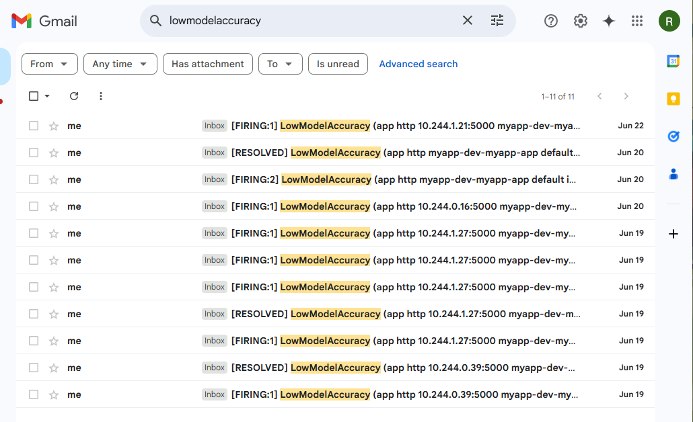

# A1 Versions, Releases, and Containerization

## A1.1 Basic Requirements

### Data Availability - Pass

- We followed the GitHub organization template as requested.
- All repositories have at least a basic README on how to contribute to the codebase.
- [operation](https://github.com/remla25-team12/operation) hosts the detailed README for deploying the entire project.

### Sensible Use Case - Pass

- Our frontend can query the model.
- Users are shown the predicted sentiment of the review and can indicate if the prediction is correct or not.
- User feedback on predictions is collected and stored in a new dataset.
- Our frontend has a "People" page with our pictures that redirect to LinkedIn pages when clicked (used in continuous experimentation).

## A1.2 Versioning & Releases

### Automated Release Process - Excellent

- [app](https://github.com/remla25-team12/app) and [model-service](https://github.com/remla25-team12/model-service) have auto-patch bumps and multiple pre-release automation.
- [lib-ml](https://github.com/remla25-team12/lib-ml) and [lib-version](https://github.com/remla25-team12/lib-version) are tagged and released manually.

### Software Reuse in Libraries - Excellent

- [lib-version](https://github.com/remla25-team12/lib-version) has a VersionUtil class that retrieves the package version using PEP 621-compliant metadata or falls back to a "dev" string if not installed as a package.

## A1.3 Containers & Orchestration

### Containers & Orchestration - Excellent

- See [.env](https://github.com/remla25-team12/operation/blob/main/.env) file.

### Docker Compose Operation - Excellent

- Docker Secret was not implemented. We discussed in class that this was not possible because Secrets only work with Docker Swarms.

# A2 Provisioning a Kubernetes Cluster

## A2.1 Provisioning

### Setting up (Virtual) Infrastructure - Excellent

- Loops and template arithmetic are used to define node IPs.
- CPU/memory/num workers are variables in Vagrantfile.
- Number of workers passed from Vagrant to Ansible.
- `./provisioning/inventory.cfg` is generated after provisioning.

### Setting up Software Environment

Good:

- Both built-in modules (community.general) and Kubernetes.core modules are used for idempotency
- Several variables are registered, e.g. "register: dashboard_token"
- Loop used for SSH keys
- Cluster does not get re-initialized upon reprovisioning:
  - general.yaml, ctrl.yaml and node.yaml are fully idempotent (no [changed] tasks after re-provisioning).
  - finalization.yaml is as idempotent as possible. Only the installation of Istio will always show [changed] (despite nothing actually changing).

Excellent:

- [Jinja2 template](https://github.com/remla25-team12/operation/blob/main/provisioning/generate_hosts.j2) is used to dynamically generate a `/etc/hosts` file.
- Waiting step: "Waiting for MetalLB webhook pod to be ready" in finalization.yaml
- Idempotent [regex-based replacement](https://github.com/remla25-team12/operation/blob/e0ee9fec4e10556e4de1efaae205570eb067ed61/provisioning/ctrl.yaml#L91)

### Setting up Kubernetes - Excellent

Sufficient:

- kubectl config: `./provisioning/admin.conf`
- Host-based kubectl can communicate with control plane after exporting `admin.conf` as environment variable.

Good:

- MetalLB installed
- HTTP Ingress Controller for Kubernetes Dashboard
- Istio Gateway for our app

Excellent:

- Kubernetes Dashboard directly reachable at dashboard.local (or 192.168.56.91)
- Nginx Ingress Controller fixed IP: 192.168.56.91
- Istio IngressGateway fixed IP: 192.168.56.99
- HTTPS Nginx Ingress Controller with self-signed certs for Kubernetes Dashboard (https://dashboard.local)
  - Your browser may still throw a security warning because the TLS certs are not signed by LetsEncrypt or another reputable Certificate Authority.

# A3 Operate and Monitor Kubernetes

## A3.1 Kubernetes & Monitoring

### Kubernetes Usage - Excellent

- Model service location defined as [environment variable](https://github.com/remla25-team12/operation/blob/c432605a8a93291e5b3acb41a59e6bbb9b3ff0b4/helm/myapp/templates/app-deployment.yaml#L27) with variable names, so can be relocated just by changing Kubernetes config.
- ConfigMap and Secret

Excellent:

- /mnt/shared is mounted in [Vagrantfile](https://github.com/remla25-team12/operation/blob/cfdc4b9c7ed25955658588abf1637150ee66ebc4/Vagrantfile#L140)

### Helm - Excellent

- Helm chart: `./helm/myapp`, contains the complete except Prometheus/Grafana/AlertManager stack (these are deployed separately as `myprom`)
- [values.yaml](https://github.com/remla25-team12/operation/blob/main/helm/myapp/values.yaml) (not .xml though)
- Can be installed more than once through the use of the "myapp.fullName" variable in all templates.

### App Monitoring - Excellent

Sufficient/Good:

- Our app-specific metrics are defined in [remla25-team12/app, app.py](https://github.com/remla25-team12/app/blob/main/app.py):
  - Counters:
    - total_reviews_submitted ('app-version' label)
    - total_correct_predictions
    - total_incorrect_predictions
    - profile_clicks ('member_name' and 'app_version' labels)
  - Histogram:
    - all_review_length_histogram ('app_version' label)
    - review_length_per_feedback_histogram ('prediction_outcome' label)
  - Gauge
    - current_percentage_of_correct_predictions_gauge ('model_version' label)
- Automatically discovered through a [ServiceMonitor](https://github.com/remla25-team12/operation/blob/main/helm/myapp/templates/service-monitor.yaml)

Excellent:

- We use AlertManager and notifications successfully reach our GMail inbox:\ 
- There is no password in the [AlertManager Secret](https://github.com/remla25-team12/operation/blob/main/helm/myapp/templates/alertmanager-secret.yaml). The password must be passed as an environment variable. For the sake of being able to test our codebase, we have included the password to our Google account in base64.

### Grafana - Excellent

- No manual installation instructions, because we use a [Configmap](https://github.com/remla25-team12/operation/blob/main/helm/myapp/templates/grafana-dashboard-configmap.yaml) to install the [dashboard.json](https://github.com/remla25-team12/operation/blob/main/helm/myapp/grafana/dashboard.json) automatically.
- Gauges, Counters, variable timeframes for parameterizable queries, and rate/avg functions are all used.

# A4

# A5
