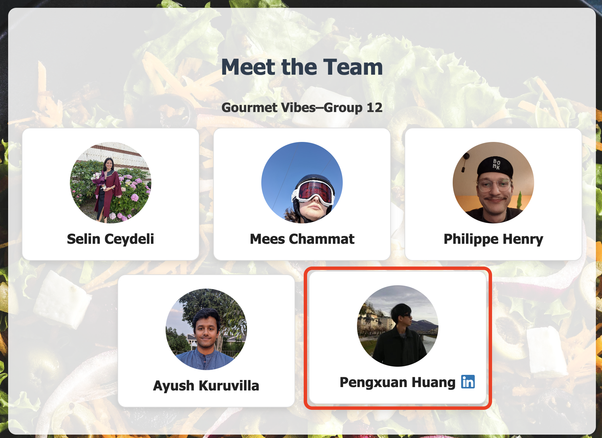
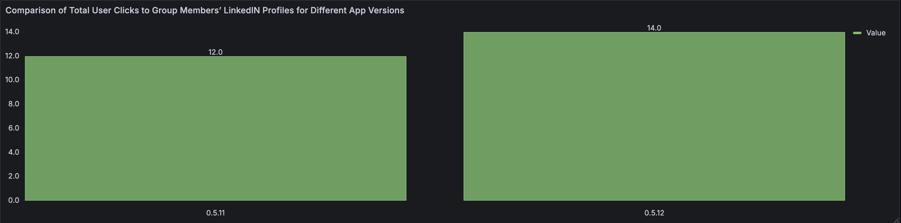

# Continuous Experiment

## Overview

As part of our continuous experiment, we want to evaluate whether a certain UI feature can impact user behavior with our app. In our current app, we believe that it is easy for users to overlook that the individual cards under the People tab are clickable, as there are no clear markings indicating that the individual cards contain any links. In addition, even if they do realize that the cards are clickable, it is unclear where the link leads.

Thus, we want to deploy a feature that allows users to realize that these pages are clickable without hurting the aesthetics of the page. We decided to add a feature that shows a LinkedIn icon next to each member's name when a user hovers over it. To test whether it is effective, we will deploy two apps and use Istio to route traffic towards the two versions. Prometheus and Grafana will be used to monitor and show the metrics comparison between the two versions.

## Hypothesis

**Null Hypothesis:** Adding the LinkedIn icon when hovering over a member card **does not** impact the number of user clicks to our member profiles.

**Alternative Hypothesis** Adding the LinkedIn icon when hovering over a member card **increases** the number of user clicks to our member profiles.

## Experiment

For the experiment, we will have two version of our app, namely v1 and v2.

- **Version 1 (v1)** is the base version with no LinkedIn icon.
- **Version 2 (v2)** introduces a LinkedIn icon that appears when hovering over a member card, suggesting that the card is clickable and links to the member’s LinkedIn profile.

Below you can see the People's page for the two app versions we will use for the experiment. As an example, you can check the bottom-right member card for the addition of LinkedIn icon on v2 of the app. The icon appears upon hovering over the member card of our team member Pengxuan Huang:

_**Figure 1:** Version 1 of our application where the member cards do not have LinkedIn icons._

_**Figure 2:** Version 2 of our application where a LinkedIn icon appears when hovering over a member card._

For both versions, clicking each member card will direct to each member's LinkedIn page. However, the key of this experiment is to evaluate whether having such an icon can help users know that it directs to members' LinkedIn pages.

To measure whether such a change leads to a difference in user behavior, we will use the **number of total clicks on members' individual LinkedIn pages** as the metric.

## Instruction to Reproduce the Experiment

Follow the instructions on the [README](https://github.com/remla25-team12/operation/blob/main/README.md) for setting up the clusters, deploying the application, and opening the Grafana dashboard. Then, manually create statistics. To create these statistics, simply go to the People page on our app and click on the member cards to visit the members' LinkedIn pages. These clicks are reflected in the **Total Click Comparison between Versions** bar chart on our Grafana dashboard.

## Interpreting the Experimental Results

We conducted a test experiment to visualize one possible experimental result. **Figure 3** shows an exemplary Grafana dashboard panel specific to this experiment. It presents the comparison of the total number of clicks to members' LinkedIn pages between the two app versions. The x-axis contains the names of the two versions, where 0.5.11 is version-1 and 0.5.12 is version-2 of our application. The y-axis represents the total number of clicks.

_**Figure 3:** The bar chart displayed on our Grafana dashboard to visualize the experimental results._

## Decision Process

To evaluate whether the new UI feature (the LinkedIn icon on hover) improves user interaction, we define a threshold-based decision criterion. Specifically, we consider the new feature effective if it increases the total number of clicks on member cards by **at least 10%** compared to the baseline version. As described in the previous sections of this documentation, we are using the *total number of clicks* as our metric to capture the impact of this new UI feature on user interaction.

We adopt the following decision rule:

- If version 2 (with the LinkedIn icon) results in 10% or more clicks than version 1, we will **reject the null hypothesis**, concluding that the feature significantly improves user interaction.
- Otherwise, we will **fail to reject the null hypothesis**, indicating that there is insufficient evidence to conclude a difference in user behavior.
