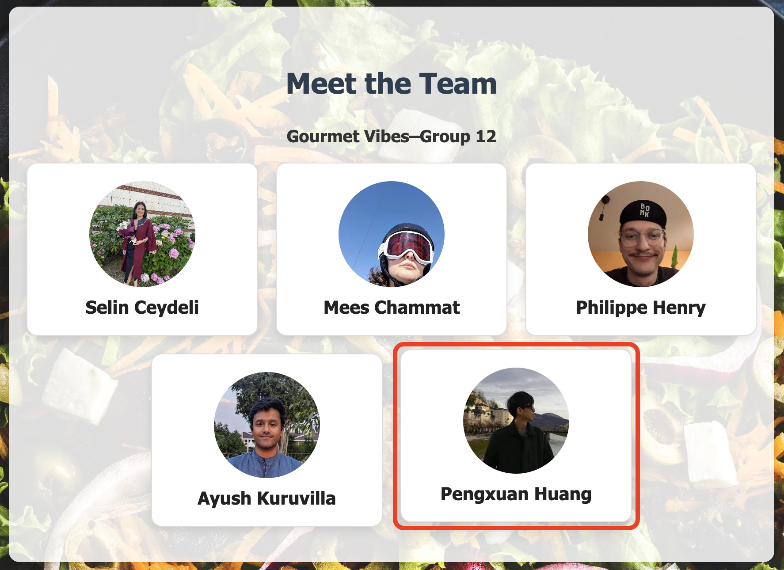

# Continuous Experiment

## Overview

As part of our continuous experiment, we want to evaluate whether a certain UI feature can impact user behavior with our app. In our current app, we believe that it is easy for users to overlook that the individual cards under the People tab are clickable, as there are no clear markings indicating that the individual cards contain any links. In addition, even if they do realize that the cards are clickable, it is unclear where the link leads.

Thus, we want to deploy a feature that allows users to realize that these pages are clickable without hurting the aesthetics of the page. We decided to add a feature that shows a LinkedIn icon next to each member's name when a user hovers over it. To test whether it is effective, we will deploy two apps and use Istio to route traffic towards the two versions. Prometheus and Grafana will be used to monitor and show the metrics comparison between the two versions.

## Hypothesis

**Null Hypothesis:** Adding the LinkedIn icon when hovering over a member card **does not** impact the number of user clicks to our member profiles.

**Alternative Hypothesis** Adding the LinkedIn icon when hovering over a member card **increases** the number of user clicks to our member profiles.

## Experiment

For the experiment, we will have two version of our app, namely v1 and v2.

- **Version 1 (v1)** is the base version with no LinkedIn icon.
- **Version 2 (v2)** introduces a LinkedIn icon that appears when hovering over a member card, suggesting that the card is clickable and links to the member’s LinkedIn profile.

Below you can see the two app versions we will use for the experiment:

**V1** \
 \

**V2** \

For both versions, clicking each member card will direct to each member's LinkedIn page. However, the key of this experiment is to evaluate whether having such an icon can help users know that it directs to members' LinkedIn pages.

To measure whether such a change leads to a difference in user behavior, we will use the **number of total clicks on members' individual LinkedIn pages** as the metric.

## Instruction to Reproduce the Experiment

Follow instructions on readme **README** to setup the app and open grafana. Then to mannually create statistics, simply go to the peoples page on our app and refresh while click on each members link. These clicks are reflected in the **Total Click Comparision between Versions** Bar chart.

## Result

The following screenshot shows the Grafana dashboard panel specific to this experiment. It presents the comparison of the total number of clicks to members' LinkedIn pages between the two app versions. The x-axis contains the names of the two versions, where 0.5.11 is V1 and 0.5.12 is V2. The y-axis represents the total number of clicks.

## Decision Process

We compare the total clicks and can only conclude if the number of total clicks in V1 is 20% higher than in V2. However, in our result, as shown in the image above, although V2, which is version 0.5.12 in this case, has a higher total click count, it is not statistically significant enough for us to draw a conclusion. Thus, we cannot reject the null hypothesis.

## Conclusion

According to our statistics, we can conclude that the feature we introduced, which is having a LinkedIn icon when a user hovers over an individual card on our People page, does not lead to more users clicking to access a member's LinkedIn profile.
