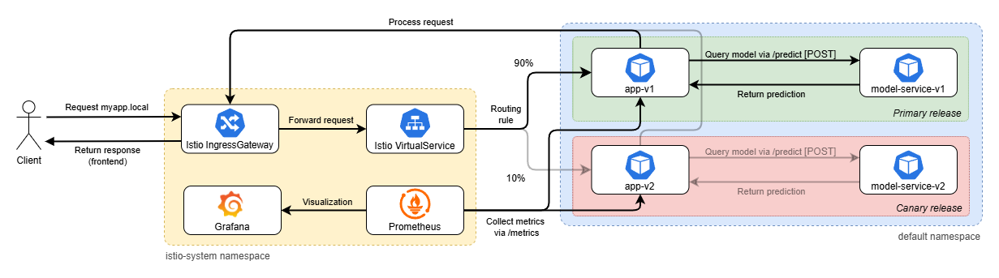

# Deployment documentation

This document details the deployment structure and data flow in our application. After reading this, you should be able to understand the overall design of our application to the point where you could contribute to a design discussion with us :)

# Table of contents
[TODO]

# Deployment overview
Our restaurant sentiment analysis project consists of six repositories, of which two containers, two libraries, one model-traning pipeline, and one collection of configuration (operation)

The two container repositories, `app` and `model-service`, form our application:
- `app` handles http requests using the Flask API, and serves the html files. It also collects metrics (see this section).
- `model-service` queries the ML model and returns the predicted sentiment of restaurant reviews submitted by users through `app`'s interface.

Both repositories are capable of automatically releasing new versions of the containers to GitHub, by means of GitHub Actions.

The `model-training` repository is not directly used by any of the containers. It is used to train, evaluate, and release new versions of the ML model.

The two Python libraries, `lib-ml` and `lib-version`, are used by several scripts across our repositories:
- `lib-ml` contains pre-processing logic for text input. Both `model-training` and `model-service` depend on this library to pre-process raw reviews, whether they're from a dataset or a submitted review.
- `lib-version` can be queried for the version of a container. `app` depends on this library to display the container versions on the home page of the application.

These libraries are also automatically versioned and released through GitHub.

## Kubernetes deployment structure
We use a custom Kubernetes cluster, provisioned through Vagrant and Ansible, on bare-metal VirtualBox VMs. Detailed installation instructions are provided in our README.

Our application is deployed into this cluster with Helm, see our [Helm chart](https://github.com/remla25-team12/operation/tree/main/helm/myapp). 

Additionally, we have also deployed **Istio** to create a service mesh that can serve two different versions of our application: v1 (primary release) and v2 (canary release). See the Figure below. 

Istio injects a so-called envoy sidecar proxy into each of the four pods of our application (two each of `app` and `model-service`), which intercepts all incoming and outgoing traffic. That traffic is then routed using a VirtualService and DestinationRules, which determine the traffic split between the primary and canary releases as well as ensure that `app-v1` communicates with `model-service-v1` (and `app-v2` with `model-service-v2`). See the next section for details on the data flow for incoming requests.

Lastly, **Prometheus**, **Grafana**, and **Kiali** are also active in the cluster for monitoring purposes.

## Data flow for incoming requests
We use an Istio service mesh for dynamic traffic routing and distribution. Its deployment configuration is defined separately in the file [istio.yaml](https://github.com/remla25-team12/operation/blob/main/helm/myapp/templates/istio.yaml). 

A client only gets to see one of two releases, either the primary or canary release. Their K8s resources (pods, deployments, services) use the `-v1` and `-v2` suffix respectively. Once a user is assigned one of the two versions, Sticky Sessions ensure that they continue to see this version even after a refresh. See also the figure below.

Figure x: Requests and data flow for a client visiting the home page of our application via `myapp.local` and leaving a review. Requests from a client assigned v1 of the experiment will only be redirected to v1 pods (black arrows), not v2 pods (low transparency arrows).

**Prometheus** collecs metrics from both versions, allowing us to compare user behavior in both versions. As part of our [continuous experimentation]() efforts, we specifically compare the difference in total number of clicks on team member profiles on the [People page](myapp.local/people) of the website. 

Furthermore, Prometheus pushes alerts to the AlertManager pod when certain metrics exceed a set threshold. This pod subsequently sends out notifications to our Gmail account.

Both **Grafana** and **Kiali** use Prometheus as a data source to provide visual monitoring capabilities. Grafana plays a major role in our continuous experimentation, as its dashboards allow us to easily compare the performance of the primary and canary releases. Kiali is mostly used as a visual Istio debugging tool.

Not pictured in the diagram are the following resources:
1. Default Kubernetes resources that live in the `kube-system` namespace. These resources are created automatically when setting up a K8s cluster, and provide essential control and networking services. For example, `etcd`, `coredns`, and `kube-proxy` are responsible for scheduling workloads, resolving service names, and routing traffic within the cluster, respectively. Since they were not explicitly deployed by us, we excluded them from the diagram.
2. LoadBalancer (`metallb-system` namespace): During provisioning, we use MetalLB to reserve a handful of IP adresses for load balancing. Both myapp.local and dashboard.local use a fixed IP from this range.

<!-- - The Istio Gateway allows requests for the host `myapp.local` to enter the Istio service mesh.
- The DestinationRules `*-model-dr` and `*-app-dr` define subsets of model-service and app, respectively, for versioned routing.
- The VirtualService `*-model-vs` defines the routing rules. Currently, 90% of incoming requests are routed to the primary version (v1) of the application, while the remaining 10% is directed to a canary version (v2). Sticky sessions are implemented using the `x-newvers` HTTP header, which ensures that once a user is assigned a specific version, subsequent requests from the same user continue to be directed to that version.
    > The 90/10 split is variable and can be set in [Values.yaml](https://github.com/remla25-team12/operation/blob/main/helm/myapp/values.yaml) by editing `istio.modelTrafficSplit.v1Weight` and `istio.modelTrafficSplit.v2Weight`. 

- The VirtualService `*-app-vs` [TODO ???] -->

## ML Pipeline
- Model training is supported by DVC
- Consists of four stages
\
Figure x: Visualization of the training pipeline for the restaurant sentiment analysis model.