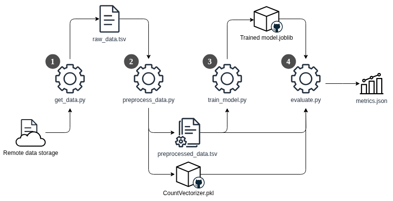

# Deployment documentation

This document details the deployment structure and data flow in our application. After reading this, you should be able to understand the overall design of our application to the point where you could contribute to a design discussion with us :)

# Table of contents
[TODO]

# Deployment overview
Our restaurant sentiment analysis project consists of six repositories, of which two containers, two libraries, one model-traning pipeline, and one collection of configuration (operation)

The two container repositories, `app` and `model-service`, form our application:
- `app` handles http requests using the Flask API, and serves the html files. It also collects metrics (see this section).
- `model-service` queries the ML model and returns the predicted sentiment of restaurant reviews submitted by users through `app`'s interface.

Both repositories are capable of automatically releasing new versions of the containers to GitHub, by means of GitHub Actions.

The `model-training` repository is not directly used by any of the containers. It is used to train, evaluate, and release new versions of the ML model.

The two Python libraries, `lib-ml` and `lib-version`, are used by several scripts across our repositories:
- `lib-ml` contains pre-processing logic for text input. Both `model-training` and `model-service` depend on this library to pre-process raw reviews, whether they're from a dataset or a submitted review.
- `lib-version` can be queried for the version of a container. `app` depends on this library to display the container versions on the home page of the application.

These libraries are also automatically versioned and released through GitHub.

## Deployment structure
We use a custom Kubernetes cluster, provisioned through Vagrant and Ansible, on bare-metal VirtualBox VMs. Detailed installation instructions are provided in our README. In this section we discuss the deployment structure, including which resources are deployed.

**Our application** is deployed into the cluster with Helm, see our [Helm chart](https://github.com/remla25-team12/operation/tree/main/helm/myapp) for configuration details. In short, the chart deploys:
- Four pods (one for each of the two versions of `app` and `model-service`) through a Deployment. More copies (ReplicaSets) can be created by changing values in [Values.yaml]().
- Four services (one for each Pod), which assign stable DNS names and ClusterIPs to the pods.
- [ConfigMaps]() for Grafana dashboards
- A [ServiceMonitor]() for the metrics endpoint of the app
- A [Secret]() for demo purposes only
- Several Istio-specific [resources]: two VirtualServices, two DestinationRules, an IngressGateway. These are all defined together in [istio.yaml](https://github.com/remla25-team12/operation/blob/main/helm/myapp/templates/istio.yaml).

**Istio** is installed during provisioning. It creates a service mesh that can serve two different versions of our application: v1 (primary release) and v2 (canary release). See the Figure below. 

After deploying our app, Istio injects a so-called envoy sidecar proxy into all four pods, which intercepts all incoming and outgoing traffic. That traffic is then routed using VirtualServices and DestinationRules, which determine the traffic split between the primary and canary releases as well as ensure that `app-v1` communicates with `model-service-v1` (and `app-v2` with `model-service-v2`). 

See the next section for a detailed example of how data flows through the network for incoming requests.

**Kubernetes Dashboard** is available in the cluster for monitoring purposes. It is accesible through an HTTPS Nginx Ingress with self-signed certificates.

**MetalLB** (applied during provisioning) provides load balancing functionality by assigning external IPs to e.g. our ingresses. Notably, two ingresses in our deployment use a fixed IP: **Kubernetes Dashboard** (192.168.56.91) and our application (192.168.56.99).

Finally, **Prometheus** and **Grafana** are also active in the cluster for data collection and visualization purposes. These are installed manually after provisioning with the [myprom Helm chart](), in the same namespace as Istio (see [README]()).

## Data flow for incoming requests
This section demonstrates how incoming client requests and other data flows through our cluster. 

In Figure 2 below, we see the data flow for incoming requests from a client, for example, a user visiting the home page of our application via `myapp.local` and leaving a review. This request does not directly go to the `app` pods. Instead, it is intercepted by Istio and routed through the IngressGateway. Based on the traffic split defined in the VirtualService, the request is then routed to the right pod. 

_**Figure x**: Data flow for incoming requests 

<!-- Requests from a client assigned v1 of the experiment will only be redirected to v1 pods (black arrows), not v2 pods (grey arrows)._ -->

DestinationRules ensure that `-v1` pods only communicate with other `v1` pods. For example. `app-v1` will only send its queries to `model-service-v1`. The same applies to `v2` pods.

The `app` container inside the pod processes the requests and returns them to the IngressGateway, so that the client receives the requested content (i.e., the browser renders the website).

A client only gets to see one of two releases, either the primary or canary release. Their K8s resources (pods, deployments, services) use the `-v1` and `-v2` suffix respectively. Once a (new) visitor is assigned one of the two versions, Sticky Sessions ensure that they continue to see this version even after a refresh. This is achieved through the header `x-newvers`. For example, if `x-newvers = true`, the user will see v2. 

In the Figure, we see that for a user who was assigned v1, traffic 

**Prometheus** collecs metrics from both versions, allowing us to compare user behavior in both versions. As part of our [continuous experimentation]() efforts, we specifically compare the difference in total number of clicks on team member profiles on the [People page](myapp.local/people) of the website. Furthermore, Prometheus pushes alerts to the AlertManager pod when certain metrics exceed a set threshold. This pod subsequently sends out notifications to our Gmail account.

Both **Grafana** and **Kiali** use Prometheus as a data source to provide visual monitoring capabilities. Grafana plays a major role in our continuous experimentation, as its dashboards allow us to easily compare the performance of the primary and canary releases. Kiali is mostly used as a visual Istio debugging tool.

Not pictured in the diagram are requests to `dashboard.local`. These are handled by a "regular" Nginx Ingress Controller (not Istio), as shown in the following figure:

## ML Pipeline
- Model training is supported by DVC
- Consists of four stages
\
Figure x: Visualization of the training pipeline for the restaurant sentiment analysis model.