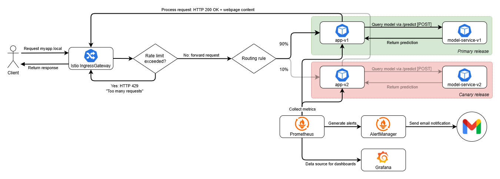

# Deployment documentation

This document details the deployment structure and data flow in our application. After reading this, you should be able to understand the overall design of our application to the point where you could contribute to a design discussion with us :)

# Table of contents
[TODO]

## Project overview
Our restaurant sentiment analysis project consists of six repositories, of which two containers, two libraries, one model-traning pipeline, and one collection of configuration (operation)

The two container repositories, `app` and `model-service`, form our application:
- `app` handles http requests using the Flask API, and serves the html files. It also collects metrics (see this section).
- `model-service` queries the ML model and returns the predicted sentiment of restaurant reviews submitted by users through `app`'s interface.

Both repositories are capable of automatically releasing new versions of the containers to GitHub, by means of GitHub Actions.

The `model-training` repository is not directly used by any of the containers. It is used to train, evaluate, and release new versions of the ML model.

The two Python libraries, `lib-ml` and `lib-version`, are used by several scripts across our repositories:
- `lib-ml` contains pre-processing logic for text input. Both `model-training` and `model-service` depend on this library to pre-process raw reviews, whether they're from a dataset or a submitted review.
- `lib-version` can be queried for the version of a container. `app` depends on this library to display the container versions on the home page of the application.

These libraries are also automatically versioned and released through GitHub.

## Deployment structure
We use a custom Kubernetes cluster, provisioned through Vagrant and Ansible, on bare-metal VirtualBox VMs. Detailed installation instructions are provided in our README. In this section we discuss the deployment structure, including which resources are deployed and when. A high-level overview of relations between resources in the cluster is shown in Figure 1.

\
_**Figure 1**: High-level overview of the deployed resources. Note that this is a non-exhaustive overview; only the most relevant resources are shown to preserve readability of the figure. For example, all resources from the kube-system namespace, and Kubernetes Dashboard's services/configs are excluded._

### Manually installed resources

**Our application** is deployed into the cluster with Helm, see our [Helm chart](https://github.com/remla25-team12/operation/tree/main/helm/myapp) for configuration details. In short, the chart deploys:
- Four pods (one for each of the two versions of `app` and `model-service`) through a Deployment. More copies (ReplicaSets) can be created by changing values in [Values.yaml]().
- Two services which assign stable DNS names and ClusterIPs to the `app` and `model-service` pods. 
- [ConfigMaps]() for Grafana dashboards
- A [ServiceMonitor]() that allows Prometheus to find the `/metrics` endpoint of the app to scrape metrics.
- A [Secret]() for demo purposes.
- Several Istio-specific [resources]: two VirtualServices, two DestinationRules, and a Gateway. These are all defined together in [istio.yaml](https://github.com/remla25-team12/operation/blob/main/helm/myapp/templates/istio.yaml).

**Prometheus** and **Grafana** are also added to the cluster for data collection and visualization purposes. They are installed  in the same namespace as Istio using the [myprom Helm chart]() and default configuration values (see [README]()).

### Provisioned resources
**Istio** itself (default profile) is installed during provisioning. It creates a service mesh that can serve two different versions of our application: v1 (primary release) and v2 (canary release).

After deploying our app manually, Istio injects a so-called envoy sidecar proxy into all four pods, which intercepts all incoming and outgoing traffic (Figure 2). That traffic is then routed according to the VirtualServices and DestinationRules, which determine the traffic split between the primary and canary releases as well as ensure that `app-v1` communicates with `model-service-v1` (and `app-v2` with `model-service-v2`). We do not use an Egress.

\
_**Figure 2:** Istio service mesh, showing the Envoy sidecar proxies in each application pod._

See the next section for a detailed example of how data flows through the network for incoming requests.

**Kubernetes Dashboard** is installed in the cluster for monitoring purposes. It is accesible through an HTTPS Nginx Ingress with self-signed certificates.

**MetalLB** provides load balancing functionality by assigning external IPs to e.g. our ingresses. Notably, two ingresses in our deployment use a fixed IP: Kubernetes Dashboard (192.168.56.91) and our application (192.168.56.99).

## Data flow for incoming requests
This section demonstrates how incoming client requests and other data flows through our cluster. 

In Figure 2 below, we see the data flow for incoming requests from a client, for example, a user visiting the home page of our application via `myapp.local` and leaving a review. This request does not directly go to the `app` pods. Instead, it is intercepted by Istio and routed through the IngressGateway. Based on the traffic split defined in the VirtualService, the request is then routed to the right pod. 

\
_**Figure 3**: Data flow for incoming requests._

DestinationRules ensure that `-v1` pods only communicate with other `v1` pods. For example. `app-v1` will only send its queries to `model-service-v1`. The same applies to `v2` pods. 

The `app` container inside the pod processes the requests and returns them to the IngressGateway, so that the client receives the requested content (i.e., the browser renders the website).

A client only gets to see one of two releases, either the primary or canary release. Their K8s resources (pods, deployments, services) use the `-v1` and `-v2` suffix respectively. Once a (new) visitor is assigned one of the two versions, Sticky Sessions ensure that they continue to see this version even after a refresh. This is achieved through the header `x-newvers`. For example, if `x-newvers = false`, the user will see v1. In Figure 3, we see that for a user who was assigned v1, traffic will only go to `app-v1` (black arrows), not to `app-v2` (greyed out arrows).

**Prometheus** collecs metrics from both versions, allowing us to compare user behavior in both versions. As part of our [continuous experimentation]() efforts, we specifically compare the difference in total number of clicks on team member profiles on the [People page](myapp.local/people) of the website. Furthermore, Prometheus pushes alerts to the AlertManager pod when certain metrics exceed a set threshold. This pod subsequently sends out notifications to our Gmail account.

**Grafana** uses Prometheus as a data source to provide visual monitoring capabilities. It is used in our continuous experimentation: the dashboards allow us to easily compare the performance of the primary and canary releases. 

Not pictured in the diagram are requests to `dashboard.local`. These are handled by a "regular" Nginx Ingress (not Istio) and forwarded to the Kubernetes Dashboard pod.

## ML Pipeline
This section briefly covers the training pipeline of the ML model. For detailed training instructions, we refer you to the [model-training repository]().

Model training is supported by DVC in addition to GitHub, and consists of four stages, shown in Figure 4. The final outputs are the model artefacts (the CountVectorizer, and the model itself in compressed `.joblib` format) and a `.json` file with model performance metrics. 
\
_Figure 4: Visualization of the training pipeline for the restaurant sentiment analysis model._

